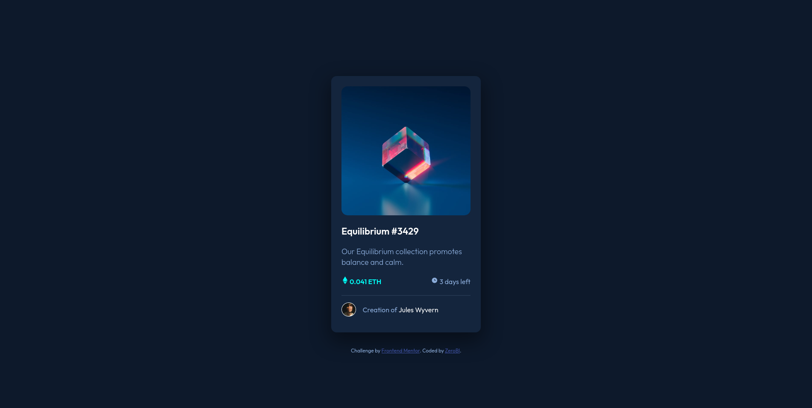

# Frontend Mentor - NFT preview card component solution

This is a solution to the [NFT preview card component challenge on Frontend Mentor](https://www.frontendmentor.io/challenges/nft-preview-card-component-SbdUL_w0U). Frontend Mentor challenges help you improve your coding skills by building realistic projects. 

## Table of contents

- [Overview](#overview)
  - [The challenge](#the-challenge)
  - [Screenshot](#screenshot)
  - [Links](#links)
- [My process](#my-process)
  - [Built with](#built-with)
  - [What I learned](#what-i-learned)
  - [Continued development](#continued-development)
- [Author](#author)


## Overview

### The challenge

Users should be able to:

- View the optimal layout depending on their device's screen size
- See hover states for interactive elements

### Screenshot



I'm not going to lie, I'm proud of this


### Links

- Solution URL: [You are here, Nice!](https://github.com/ZeroBl21/NFT-card)
- Live Site URL: [Github Pages](https://zerobl21.github.io/NFT-card/)

## My process

### Built with

- Semantic HTML5 markup
- CSS custom properties
- Flexbox
- Mobile-first workflow
- [Normalize.css](https://necolas.github.io/normalize.css/) 


### What I learned

I realized at the last moment the hover in the image, so in the first versions it is not there, let's see if the Zero of tomorrow adds it.


and now random thoughts what i have of my code:


I don't know if I have to use articles or something different in this part and not spam divs

```html
<div class="main-title">
    <h2><a href="#">Equilibrium #3429</a></h2>
    <p>Our Equilibrium collection promotes balance and calm.</p>
</div>

<div class="main-info">
    <p class="main-info__price"><span class="etherium"></span> 0.041 ETH</p>
    <p ><span class="clock"></span> 3 days left</p>
</div>


<div class="main-creator">
    
    <p>Creation of <a href="#">Jules Wyvern</a></p>
</div>

<footer class="attribution">
    Challenge by <a href="https://www.frontendmentor.io?ref=challenge" target="_blank">Frontend Mentor</a>. 
    Coded by <a href="#">ZeroBl</a>.
</footer>
```


  I Need use this more, is so useful

```css
.wrapper{
    display: flex;
    align-items: center;
    justify-content: center;
    height: 100%;
}
```


### Continued development

I must try to learn to program faster, I think I have taken too long in this simple problem, although everyone goes at their own pace. in addition to not forgetting that I am using Git for something, although in this problem it was not necessary.

## Author

- Portfolio - [ZeroBl](https://zerobl21.github.io/Portfolio/)
- Frontend Mentor - [@ZeroBl21](https://www.frontendmentor.io/profile/ZeroBl21)
- Twitter - [@ZeroBlackFenix](https://www.twitter.com/@ZeroBlackFenix)

